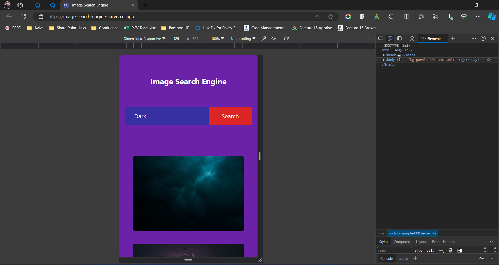

# Image Search Engine

This is a simple image search engine that utilizes the Unsplash API. Users can input any keyword into the search bar, and the engine will display photos related to that category. Initially, 12 images are displayed, and users can load more images by clicking the "Load More" button.

## Demo

The project is live at [https://image-search-engine-six.vercel.app/](https://image-search-engine-six.vercel.app/).

## Technologies Used

- HTML
- JavaScript
- [Tailwind CSS](https://tailwindcss.com/)
- [Unsplash API](https://unsplash.com/developers)

## Installation

No installation is required. Simply open the project in a web browser.

## Usage

1. Open the project in a web browser.
2. Enter a keyword into the search bar.
3. Click the "Search" button.
4. Browse through the displayed images.
5. To load more images, click the "Load More" button.

## Screenshots

Image 1:

Image 2:

Image 3:

Image 4:

## Contributing

Contributions are welcome! If you'd like to contribute to this project, please raise a Pull Request.

## License

This project is licensed under the MIT License - see the [LICENSE](LICENSE) file for details.
